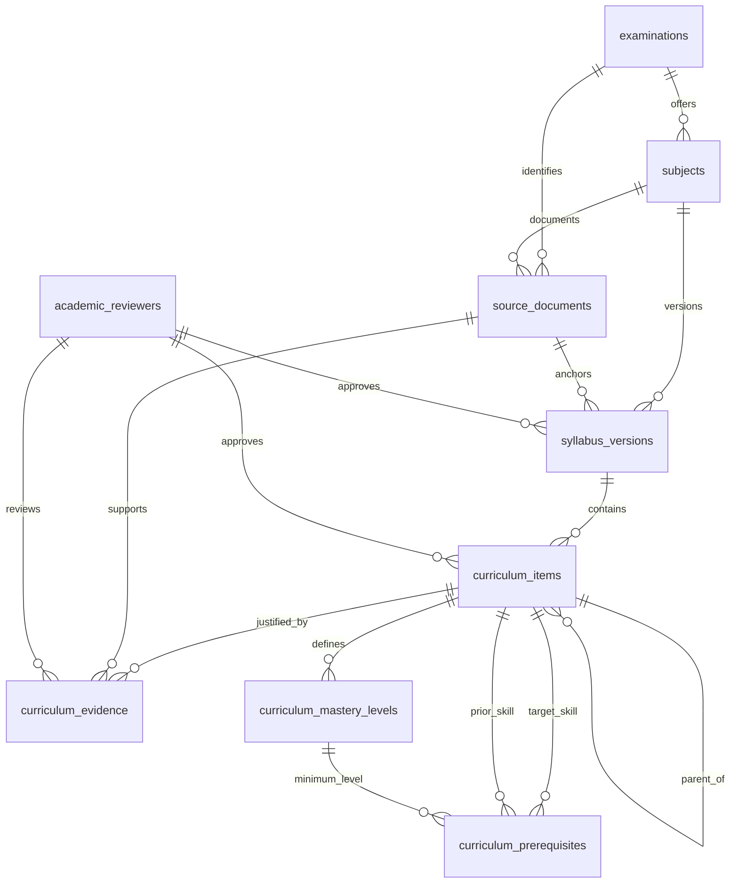

# Syllabus database foundation

This is the first database slice for the **NECO GCE Mathematics** pilot selected in
[`product-specification.md`](product-specification.md). The attached *StackPrep — Complete
Project Data Model v1.1* is a proposed design, not an official syllabus or executable
migration. The migration is at [`database/migrations/001_curriculum.sql`](../database/migrations/001_curriculum.sql).

No Mathematics topics, exam dates, grading rules, or paper structures have been seeded.
An academic reviewer must first identify the exact official examination track and
applicable syllabus document. The attached HTML calls the exam “NECO SSCE External”;
the product specification calls it “NECO GCE Mathematics.” Confirm the official
identifier before creating the first real `examinations` row.

## Relationship map



`examinations` means the **official target examination**. A diagnostic, practice set,
or mock created by StackPrep is a separate future `assessments` record. `subjects` is
exam-specific: a Mathematics subject under one examination cannot silently inherit
another body's syllabus.

The topic tree uses one `curriculum_items` table. A topic has no parent, a subtopic
belongs to a topic, and an assessable skill belongs to a subtopic. For example,
“Algebra → Simultaneous equations → Translate word problems” illustrates the shape
only; it is **not** a verified statement about the current NECO syllabus. An item can
have several evidence rows, and a skill can have several defined mastery levels.

## Attributes taken from the attached HTML

| Entity | Important attributes | Why they matter |
| --- | --- | --- |
| `examinations` | name, short name, exam body, country, optional verified grading rules, status | Separates official exam tracks from platform tests. |
| `subjects` | exam ID, code, name, status | Keeps each subject attached to exactly one examination. |
| `source_documents` | type, title, year/paper code, stored file URI/hash, MIME type, page count, licence, processing and review status | Records provenance and rights before a document supports published content. |
| `syllabus_versions` | subject, label, official identifier if known, validity dates if known, source document, approval, current flag | Preserves which syllabus version supported a decision. Unknown dates remain null. |
| `curriculum_items` | version, subject, parent, type, code, name, learning objective, examinable scope, expected depth, boundary notes, syllabus status, review | Represents topics, subtopics and skills without separate tables for each depth. |
| `curriculum_mastery_levels` | skill, level number, name, description, cognitive demand, entry/exit criteria, suggested question count, review | Defines a level for **that skill**, not a global difficulty number. |
| `curriculum_prerequisites` | target skill, prior skill, optional required level, strength, reason, review | Explains a dependency; only approved required edges are prevented from forming cycles. |

Two additions make the pilot scope usable:

- `curriculum_evidence` replaces the HTML's single `source_document_id`, page and
  excerpt on each item. One item may need several syllabus excerpts or an approved
  academic boundary decision. Each link is reviewed separately.
- `pilot_support_status` is separate from `syllabus_status`. A skill may be in the
  official syllabus but still be `planned` or `unsupported` in the limited pilot.
  New extractions start `undecided` until that product decision is made.
  This distinction follows the current product specification's requirement to map
  the full syllabus while initially teaching only 12–18 reviewed skills.
- `storage_permission`, `student_delivery_permission` and
  `model_context_permission` make the HTML's rights distinction explicit. Approval
  of a file for storage does not grant student display or AI-context use. The
  published views require student delivery permission for their source evidence.

The migration also uses a small `academic_reviewers` table so approval fields have
real foreign keys. When authentication is built, connect its accounts through
`external_user_id` or migrate these references to the final users table.

## “Not in the syllabus” needs careful states

| `syllabus_status` | Meaning | Student-facing implication |
| --- | --- | --- |
| `explicit` | Named in a reviewed syllabus source. | Can be shown as in scope once approved. |
| `implied` | Academic interpretation supported by reviewed evidence. | Show the scope and depth with care. |
| `prerequisite_only` | Useful prior knowledge, but not itself claimed as an examinable target. | Can be taught to repair a gap; do not count as exam coverage. |
| `excluded` | An explicit reviewed boundary says it is outside this version. | Do not serve it as exam practice. |
| `uncertain` | Evidence is not yet sufficient. | Keep out of published teaching until reviewed. |
| `retired` | Historical item kept for audit. | Do not use in a new plan. |

**Absence from a PDF, or absence from historical questions, is not exclusion evidence.**
An `excluded` item can be approved only when it has an approved explicit exclusion
source or an approved academic boundary decision with a rationale and a reference to
the evidence considered. Even then, the
decision belongs to one syllabus version; it must be revisited when the version
changes. For a bounded pilot, use `pilot_support_status = 'unsupported'` on an
in-syllabus skill instead of marking it `excluded`.

## Approval and update sequence

1. Create the examination and its Mathematics subject after confirming the official
   name and track.
2. Upload the authorised syllabus file outside PostgreSQL. Store its URI and SHA-256
   in `source_documents`; record issuer, version evidence, review and distinct
   storage, delivery and AI-context permissions.
3. Create a draft `syllabus_versions` row. Approve it only after the source document
   is reviewed and rights-verified. Set `is_current` only when that version should
   drive new learner plans.
4. Create draft topic, subtopic and skill rows. Add reviewed `curriculum_evidence`
   for each. Approve parents before children. Record `pilot_support_status`
   independently from the official scope decision.
5. Define and review levels for approved skills. Add reviewed prerequisite links,
   with reasons and an optional approved minimum level.
6. Read `published_curriculum_scope` for the student-visible approved map and
   `teachable_skills` for the currently supported skill list. These views omit
   source excerpts and internal decision rationale.

Approved syllabus content is immutable in this first migration. A revised official
scope requires a new syllabus version; old rows remain for historical attempts and
plans. One current approved version is allowed per subject. Approved validity ranges
cannot overlap. With unknown dates, the unbounded range blocks approving a second
overlapping version until the old one is superseded.

## How this supports the future AI score booster

The first planning pass should read only approved current skills, their pilot support
state, prerequisites and reviewed levels. Later `questions` and
`question_classifications` will connect approved items to a primary skill and level;
`assessments`, responses and diagnosis will provide learner evidence. The plan can
then cite the exact skill, evidence and rule version behind each recommendation.
AI can propose extraction or classifications, but those proposals must remain pending
until reviewed. A question-generation profile can later reference the exact approved
syllabus version, skill and level. Neither this schema nor a short diagnostic creates
a defensible official exam score forecast.

## Apply and verify

The project now has a hash-checked PDF loader and a local PostgreSQL setup. See
[`database/README.md`](../database/README.md) for the import command, draft-state
gates and inspection queries.

Use a disposable PostgreSQL database first:

```sh
psql -v ON_ERROR_STOP=1 -d scorepilot -f database/migrations/001_curriculum.sql
psql -v ON_ERROR_STOP=1 -d scorepilot -f database/tests/001_curriculum.sql
```

The test transaction rolls back its synthetic data. It checks a valid hierarchy,
approved skill publication, required-prerequisite cycle rejection, exclusion evidence,
and cross-version parent rejection. The migration is intentionally only the curriculum
foundation; it does not create student, question, assessment, payment or tutor tables.
